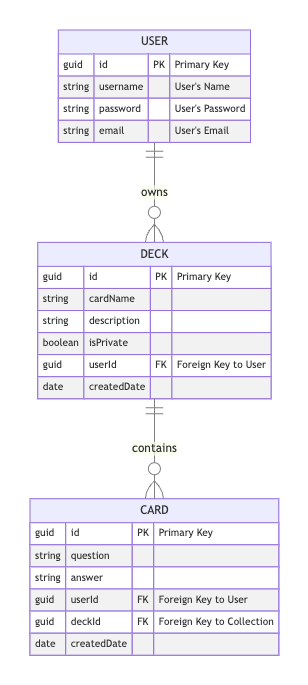

# Seal project 3

- **Contributors: Yuliya Buiko, Tim Rodrigues, Mackenzie Wicker, Roman Larionov**
- **App Name: Study-Body**
- **Description: Server-side app that contains sets of APIs to fetch, insert, delete and update data. The APIs contain routes for deks, cards that support full crud data manipulation**
- **GitHub Url: https://github.com/timorodr/Unit3_PROJECT_BE.git**
- **Deployed WebSite: https://unit3-project-be.onrender.com/**
- **Trello Board: https://trello.com/b/RYq8mpis/flash-cards-project**

## List of Dependencies

##### Node Dependencies (package.json)

- express
- dotenv
- mongoose
- morgan
- bcrypt
- express-session
- connect-mongo

## Route Map

List of different routes and their purpose in the app

### DECK routes

| Route Name | Endpoint  | Metod  |        Description        |
| :--------: | :-------: | :----: | :-----------------------: |
|   Index    |   /deck   |  Get   |     Return all decks      |
|  Destroy   | /deck/:id | Delete |     Delete deck by id     |
|   Update   | /deck/:id |  Put   |        Update deck        |
|   Create   |   /deck   |  Post  |      Create new deck      |
|    Show    | /deck/:id |  Get   | Return deck details by id |

### DECK - CARD routes

| Route Name |      Endpoint       | Metod |                     Description                     |
| :--------: | :-----------------: | :---: | :-------------------------------------------------: |
|    Show    | /deck/:deckId/card/ |  Get  | Return deck and assosiated cards details by deck id |

### CARD routes

| Route Name |     Endpoint      | Metod  |        Description        |
| :--------: | :---------------: | :----: | :-----------------------: |
|   Index    |   /card/:deckId   |  Get   |      Return all card      |
|  Destroy   | /card/:deckId/:id | Delete |     Delete card by id     |
|   Update   | /card/:deckId/:id |  Put   |        Update card        |
|   Create   |   /card/:deckId   |  Post  |     Creates new card      |
|    Show    |     /card/:id     |  Get   | Return card details by id |

### USER Routes

| Route Name |   Endpoint   | Metod |     Description      |
| :--------: | :----------: | :---: | :------------------: |
|   Create   | /user/signup | Post  |   Create new user    |
|   Create   | /user/login  | Post  |     Sign in user     |
|   Logout   | /user/logout |  Get  | Distroy user session |

## ERD (Entity Relationship Diagram)

